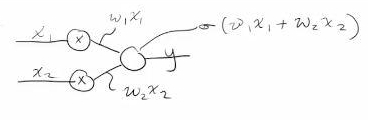
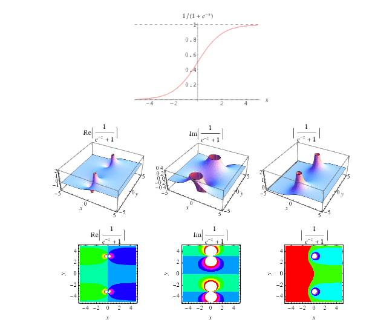
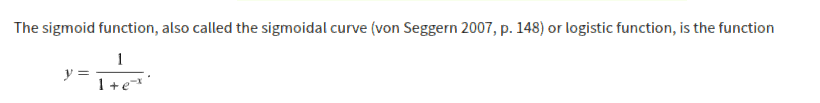
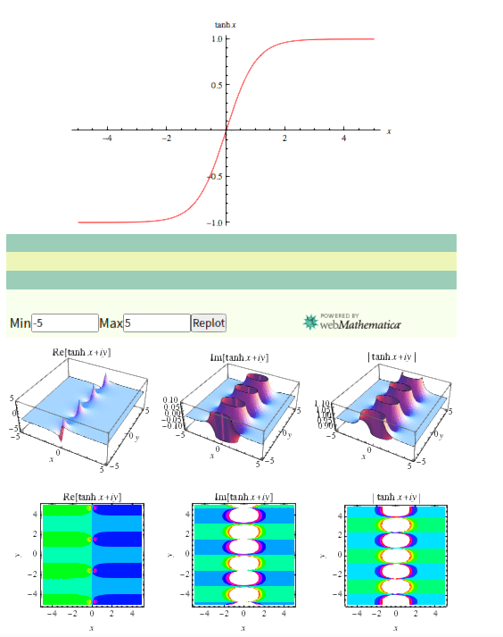
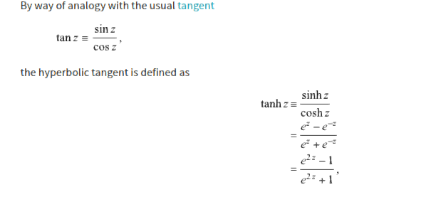
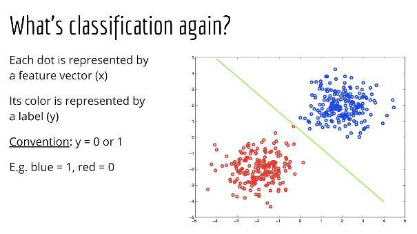
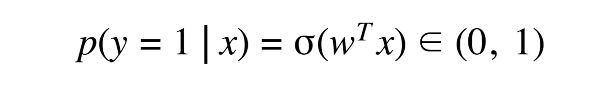
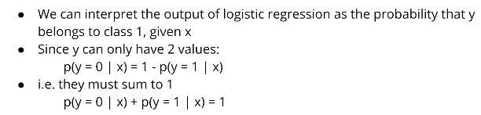

# How do we calculate the output of a neuron(Logistic Regression):
Just link in a brain of any organism is a collection of neurons which is a building block of a brain in a similar fashon,
a logistic regression is also a building black of a neural network.
#### Here is a diagram of a logistic regression (a single neuron) that is the building block of a neural network.

Here as you can see in the above diagram there are two circles with X's are multipliers which multiplies the x1 and x2 with the w1 and w2 here (w1 and w2 are the weights). and then there is another circle with nothing in that which is a summer and a non-linear transformer sigmoid(w1x1 + w2x2). So the unique thing about the logistic regression is the circle that comes in front of the output y. It applies logistic function or the sigmoid function.
#### Here is a diagram of a Sigmoid or Logistic function:

Sigmoid Function has a finite limit as X approaches infinity and a finite limit as X approaches minus infinity.Sigmoid function goes from 0 to 1 and it's Y-intercept is 0.5.There are two commonly used Sigmoid functions that are used in AI/ML,
one is hyperbolic tangent or tanh(x) which goes from (-1,1) and it's Y=intercept is 0 and another one is a sigmoid function denoted by a letter called sigma as we have seen above.
#### Here is a diagram of tanh function or hyperbolic tangent function:

So we can combine these to say the output of a logistic regression is --> sigma of the inner products of the weights times X σ( w^t.x). So if the inner product of w and x is very positive then we will get the number that is very close to 1. If the inner product of W and X is very negative we will get the number that is very close to 0. If the output of sigmoid function is 0.5 then the value of inner product is 0 which means we are right at the boundary between the two classes (The probability of belognging to either classes is 50%).

## Difference between Logistic regression and general linear classifier:
We have this logistic function (Sigmoid function) at the end which gives us the number between 0 and 1. here we can say that anything which gives us a number above 0.5 gives us class 1 and anything below 0.5 gives us class 0. the value of sigmoid for input 0 is 0.5.

# What does the output of Logistic regression actually means?

The output of the logistic regression is a sigmoid. form the sigmoid we are going to get a number between 0 and 1. In deep learning it has a nice and intuitive interpretation.
First let's recall what we are trying to do during classification.

We have some red dots and some blue dots and we have a line that separates them. Each dot is represented by a feature vector X and it's color or it's label is represented by a label Y. as per conventions Y has a value 0 or 1. here if Y=0 --> red if Y=1 --> blue.  

The output of logistic regression is a number between 0 and 1, we interpret these as a probability that y=1 given x.

